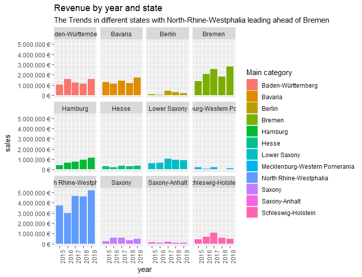
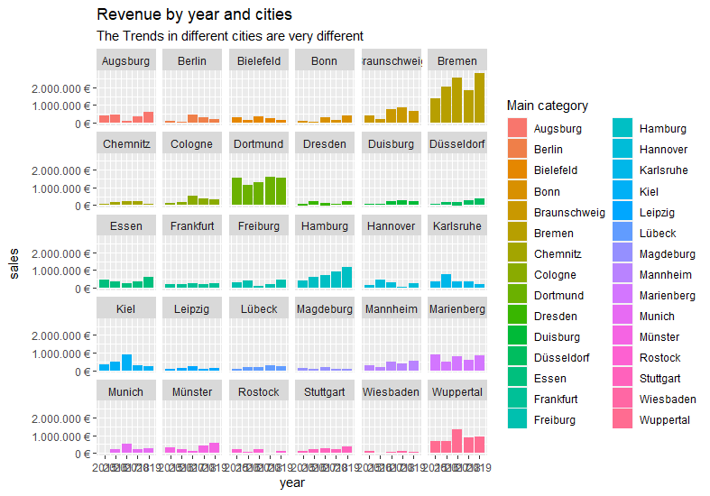
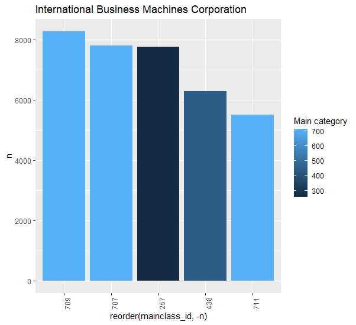
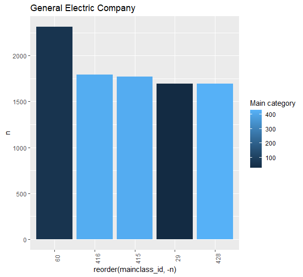
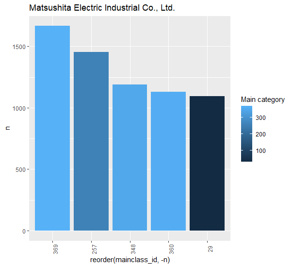
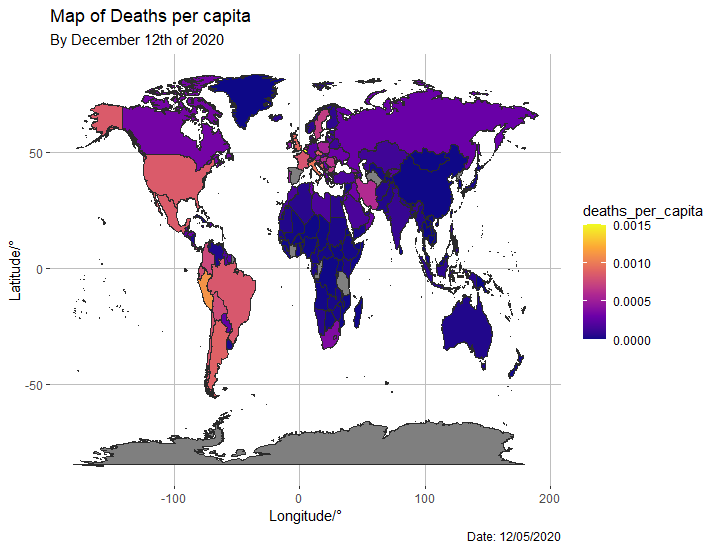

```{r setup, include=FALSE}
knitr::opts_chunk$set(message=FALSE,warning=FALSE, cache=TRUE)
```


# introduction

This is the Lab Journal for Business Data Science Basics 2020. In the following chapters 4 challenges were to solve. The chapters are composed of a bit of description, the figures bulit by the code, some example tibbles to keep track with the developing code and the codes themselves.

# First Assignement: Bike Sales at different cities in germany

The assignement was to configure a given Dataset to analyze bike sakes in germany. The dataset has been reorganized to be plotable such that the used data sets are the City of interest and the total bike sales in that specific city from 2015 to 2019. The result is given in the figure below. Especially Dortmund, Breen and Wuppertal had a large amount of Bike sales from 2015 to 2019.

 




The result of the question which state has the highest revenue is: North-Rhine_Wesphalia.In addition to this another chart grouped by the cities was built. The city with the most bike sales over the considered cities is Bremen, followed by Freiburg.




```{r,eval=FALSE}
# Data Science at TUHH ------------------------------------------------------
# SALES ANALYSIS ----

# 1.0 Load libraries ----
library("tidyverse");
library("readxl");
library("lubridate")
library("writexl")

# 2.0 Importing Files ----
bike_data<-read_excel("00_Data/01_bike_sales/01_raw_data/bikes.xlsx");
shop_data<-read_excel("00_Data/01_bike_sales/01_raw_data/bikeshops.xlsx");
order_data<-read_excel("00_Data/01_bike_sales/01_raw_data/orderlines.xlsx");

# 3.0 Examining Data ----
#order_data

# 4.0 Joining Data ----
glimpse(order_data)
whole_data<-left_join(order_data,bike_data,by =c("product.id"="bike.id"));
whole_data<-left_join(whole_data,shop_data,by =c("customer.id"="bikeshop.id"));

# 5.0 Wrangling Data ---- 
whole_data <-whole_data %>% 
  mutate(total.price=price*quantity)%>%
  select(order.id, contains("order"), contains("model"), contains("category"),price, quantity, total.price,everything())%>%
  
  separate(col="category", into=c("C1", "C2", "C3"), sep = " - ")%>%
  separate(col="location", into=c("City","State"),sep =", ")


whole_data<-whole_data%>%select(-...1,-gender,-url) %>%

  rename(bikeshop = name) %>%
  set_names(names(.) %>% str_replace_all("\\.", "_"))
glimpse(whole_data)


# 6.0 Business Insights ----
#rearrange data
#goal -> have the data plottable

sb_year<-whole_data %>%
    select(order_date,total_price);


  
# 6.1 Sales by Year ----


# Step 1 - Manipulate
sb_year<-sb_year %>% mutate(year=year(order_date))%>%
  select(-order_date)%>%
  group_by(year)%>%
  summarize(sales=sum(total_price))%>%
  mutate(sales_text = scales::dollar(sales, big.mark = ".", 
                                     decimal.mark = ",", 
                                     prefix = "", 
                                     suffix = " €"));
# Step 2 - Visualize


# 6.2 Sales by Year and Category 2 ----

sb_cat<-whole_data %>%
  select(C1,total_price,order_date);

# Step 1 - Manipulate

sb_cat<-sb_cat%>% 
  mutate(year=year(order_date))%>%
  select(-order_date)%>%
  
  
 
  group_by(year,C1)%>%
  summarize(sales=sum(total_price))%>%
  ungroup()%>%
  mutate(sales_text = scales::dollar(sales, big.mark = ".", 
                                     decimal.mark = ",", 
                                     prefix = "", 
                                     suffix = " €"));


# 6.3 Challenge Assignement Cities and States ----


sales_by_Cities<-whole_data %>%
  select(City,total_price,State,order_date)%>%
  mutate(year=year(order_date))%>%
  select(-order_date)%>%
  group_by(City,State,year)%>%
  summarize(sales=sum(total_price))%>%
  ungroup()%>%
  mutate(sales_text = scales::dollar(sales, big.mark = ".", 
                                     decimal.mark = ",", 
                                     prefix = "", 
                                     suffix = " €"));

sales_by_State<-whole_data%>%
  select(total_price,State,order_date)%>%
  mutate(year=year(order_date))%>%
  select(-order_date)%>%
  group_by(State,year)%>%
  summarize(sales=sum(total_price))%>%
  ungroup()%>%
  mutate(sales_text = scales::dollar(sales, big.mark = ".", 
                                     decimal.mark = ",", 
                                     prefix = "", 
                                     suffix = " €"));


# Step 2 - Visualize


# Visualize the challenge task ----


sales_by_Cities %>%
  
  # Set up x, y, fill
  ggplot(aes(x = year, y = sales, fill = City)) +
  theme(axis.text.x = element_text(angle = 90, hjust = 1)) +
  # Geometries
  geom_col() + # Run up to here to get a stacked bar plot
  
  
  # Facet
  facet_wrap(~ City) +
  
  # Formatting
  scale_y_continuous(labels = scales::dollar_format(big.mark = ".", 
                                                    decimal.mark = ",", 
                                                    prefix = "", 
                                                    suffix = " €")) +
  
  labs(
    title = "Revenue by year and cities",
    subtitle = "The Trends in different cities are very different",
    fill = "Main category" # Changes the legend name
    
  )

# Visualize the challenge task ----


sales_by_State %>%
  
  # Set up x, y, fill
  ggplot(aes(x = year, y = sales, fill = State)) +
  theme(axis.text.x = element_text(angle = 90, hjust = 1)) +
  # Geometries
  geom_col() + # Run up to here to get a stacked bar plot
  
  
  # Facet
  facet_wrap(~ State) +
  
  # Formatting
  scale_y_continuous(labels = scales::dollar_format(big.mark = ".", 
                                                    decimal.mark = ",", 
                                                    prefix = "", 
                                                    suffix = " €")) +
  
  labs(
    title = "Revenue by year and state",
    subtitle = "The Trends in different states with North-Rhine-Westphalia leading ahead of Bremen",
    fill = "Main category" # Changes the legend name
    
  )


# 7.0 Writing Files ----


# 7.1 Excel ----
sb_year %>%
  write_xlsx("00_data/01_bike_sales/02_wrangled_data/sales_by_year.xlsx")
sb_cat %>%
  write_xlsx("00_data/01_bike_sales/02_wrangled_data/sales_by_year_and_Category_1.xlsx")

# 7.2 CSV ----
sb_year %>% 
  write_csv("00_data/01_bike_sales/02_wrangled_data/sales_by_year.csv")
sb_cat %>%
  write_csv("00_data/01_bike_sales/02_wrangled_data/sales_by_year_and_Category_1.csv")

# 7.3 RDS ----
sb_year %>% 
  write_rds("00_data/01_bike_sales/02_wrangled_data/sales_by_year.rds")
sb_cat %>%
  write_rds("00_data/01_bike_sales/02_wrangled_data/sales_by_year_and_Category_1.rds")


```


# Data Acquisition

The Data Acquisition chapters topic is web scraping. This can be useful if the acquisition of huge data sets for competitor data is needed. R i able to communicate with html and css scripts of which websites are composted. The exercise was conducted to learn a bit abourt html, css and the corresponding routines in R. As the challenge, some data should be scraped from another wesite. This is done with the Rosebikes website. The results are shown in the following.

```{r,eval=TRUE}

test<-readRDS("00_Data/01_bike_challenge/bikes_tbl.rds")%>%head(10)
test

```

There has been a data tibble derived from the "rosebikes.de" website of which 10 rows can be seen above. Using the Data connected here, further investigations could be possible. Te contained Data is the Model name, the category, the url for category and the bike itself as well as the individual bikes price, as requested.

The code written for this purpose is given here:

```{r,eval=FALSE}

# Data Science at TUHH ------------------------------------------------------
# SALES ANALYSIS ----

bikeclasses_tbl<-function(url,integer,family,family_id_url){
  
  bike_name_tbl <- url %>%
    read_html()%>%
    html_nodes(css = ".catalog-category-bikes__title-text") %>% 
    
    html_text() %>%
    str_remove(pattern = "\n") %>%
    str_remove(pattern = "\n") %>%
    # Convert vector to tibble
    enframe(name = "position", value = "subdirectory") %>%
    mutate(category = family[integer])%>%
    mutate(class_url = family_id_url[integer])
    
  
}


# 1.0 Load libraries ----
library("tidyverse")
library("readxl")
library("lubridate")
library("writexl")
library("RSQLite")
library("DBI")
library("httr")
library("glue")
library("jsonlite")
library("rvest")
library("purrr")
library("xopen")
library("stringi")


#gotten canyon url stuff and ready for analysis

# 1.1 COLLECT PRODUCT FAMILIES ----

url_home          <- "https://www.rosebikes.de/fahrräder"
#xopen(url_home) # Open links directly from RStudio to inspect them

# Read in the HTML for the entire webpage
html_home         <- read_html(url_home)

# Web scrape the ids for the families
bike_family_tbl <- html_home %>%
  
  # Get the nodes for the families ...
  html_nodes(css = ".catalog-navigation__link") %>%
  # ...and extract the information of the id attribute
  html_attr('href') %>%
  
  discard(.p = ~stringr::str_detect(.x,"Sale|Finder|Kinder")) %>%
  
  # Convert vector to tibble
  enframe(name = "position", value = "family_class")%>%
  
  # build individual urls for each category page
  mutate(
    family_url = str_glue("https://www.rosebikes.de{family_class}")
  )

bike_family_tbl

# 1.2 COLLECT PRODUCT CATEGORIES ----

# Combine all Ids to one string so that we will get all nodes at once
# (seperated by the OR operator ",")
family_id_url <- bike_family_tbl %>%
  pull(family_url)

bike_family<-bike_family_tbl%>%
  pull(family_url)%>%
  str_remove(pattern = "https://www.rosebikes.de/fahrräder/")
  
family_id_url
url<-family_id_url[1]

bikes_tbl<-bikeclasses_tbl(family_id_url[1],1,bike_family,family_id_url)
for(i in 2:12){
  
  add<-bikeclasses_tbl(family_id_url[i],i,bike_family,family_id_url)
  bikes_tbl<-add_row(bikes_tbl,add)
  
}

#===================================================================
#versuch mit mutate eine weitere Spalte zu bikes_tbl hinzuzufügen
for(i in 1:nrow(bike_family_tbl)){
  add<-family_id_url[i]%>%
    read_html()%>%
    html_nodes(css = ".catalog-category-bikes__content > a") %>%
    html_attr("href") %>%
    as_tibble%>%
    mutate(Name= family_id_url[i]%>%
             read_html()%>%
             html_nodes(css = ".catalog-category-bikes__title-text") %>%
             html_text() %>%
             str_remove(pattern = "\n") %>%
             str_remove(pattern = "\n") 
    
  )%>%
  mutate(price=family_id_url[i]%>%
           read_html()%>%
           html_nodes(css = ".catalog-category-bikes__price-title") %>%
           html_text()%>%
           str_remove(pattern = "\nab ")
           
           )
    
    if (i==1) {
      misc_bikedata<-add
    } else {
      misc_bikedata<-add_row(misc_bikedata,add)
    }
  
}

bikes_tbl<-left_join(bikes_tbl,misc_bikedata,by=c("subdirectory"="Name"))

bikes_tbl %>% 
  write_rds("00_Data/01_bike_challenge/bikes_tbl.rds")


```
# Data Wrangling

Last compiled: `r Sys.Date()`

In the Third challenge, patents of various companies should be analized. The data provided are huge sets which comes with another challenge. Joining too large sets of data is not possible so tha data has to be cleaned prior to joining it togeher. This begins with deciding which columns of data is actually nessecary for the analization. Unnessecary data can be directly discarded by defining the corresponding column as col_skip().

## Companies with the most patent activities in the US
The task is to find the ten Companies in the US who have the higest number of assigned patents. This is done using the "assignee" and "patent_assignee" datasets provided by the institute. After a bit of data rearrangement, the following chart could be isolated


The 10 most effective companies in terms of patent assignement are listed on the ordinate. The most dominant company in the US when it comes to patents is the International Busines Machines Cormporation.


The code to this graph is the following.

```{r,eval=FALSE}

library(vroom)
library(tidyverse)
library(data.table)


'col_types <- list(
  id = col_integer(),
  type = col_character(),
  number = col_integer(),
  country = col_character(),
  date = col_date("%Y-%m-%d"),
  abstract = col_character(),
  title = col_character(),
  kind = col_character(),
  num_claims = col_double(),
  filename = col_character(),
  withdrawn = col_character()
)

patent_tbl <- vroom(
  file       = "00_Data/03_patents/patent.tsv", 
  delim      = "\t", 
  col_types  = col_types,
  na         = c("", "NA", "NULL")
)

#glimpse(patent_tbl)'

col_types <- list(
  patent_id = col_integer(),
  assignee_id = col_character(),
  location_id = col_character()
  )

patent_assignee_tbl <- vroom(
  file       = "00_Data/03_patents/patent_assignee.tsv", 
  delim      = "\t", 
  col_types  = col_types,
  na         = c("", "NA", "NULL")
)

col_types <- list(
  id = col_character(),
  type = col_integer(),
  name_first = col_character(),
  name_last = col_character(),
  organization = col_character()
)

assignee_tbl <- vroom(
  file       = "00_Data/03_patents/assignee.tsv", 
  delim      = "\t", 
  col_types  = col_types,
  na         = c("", "NA", "NULL")
)

'col_types <- list(
  uuid = col_character(),
  patent_id = integer(),
  mainclass_id = col_integer(),
  subclass_id = col_character(),
  sequence = col_integer()
)

uspc_tbl <- vroom(
  file       = "00_Data/03_patents/uspc.tsv", 
  delim      = "\t", 
  col_types  = col_types,
  na         = c("", "NA", "NULL")
)'
glimpse(patent_assignee_tbl)
glimpse(assignee_tbl)
#1. Which US Company has the most Patents
#join data 
wrangeled<-left_join(patent_assignee_tbl,assignee_tbl,by = c("assignee_id"="id"))
#only patents od US Companies shall be counted e.g. the type has to be exactly 2


wrangeled<-wrangeled%>%
  filter(type == 2)%>%
  select(organization, patent_id, everything())%>%
  select(-name_first, -name_last, -location_id, -assignee_id)%>%
  arrange(desc(organization))


Patentnumber<-wrangeled%>%
  filter(!is.na(patent_id))%>%
  count(organization)%>%
  arrange(desc(n))

head(Patentnumber,10)

Picture_table<-Patentnumber%>%
  slice(1:10)
## Visualize

Picture_table %>%
  
  # Setup canvas with the columns year (x-axis) and sales (y-axis)
  ggplot(aes(x = reorder(organization,-n),n, y = n)) +
  theme(axis.text.x = element_text(angle = 90))+
  # Geometries
  geom_col(fill = "#2DC6D6") + # Use geom_col for a bar plot
  
 
  
  # Formatting
  # scale_y_continuous(labels = scales::dollar) + # Change the y-axis. 
  # Again, we have to adjust it for euro values
  labs(
    title    = "Number of Patents for different US Companies",
    
    x = "", # Override defaults for x and y
    y = "Number of Assigned Patents"
  )


```
## Companies with the most granted patents in 2019

In assignement 3.2 the top ten companies with granted patents for 2019 were searched. For this task the information "withdrawn" in the patents.tsv dataset was the most important. Also as the patents which weren't granted in 2019 were subtracted the top the was distributed differently than the query from before.


The 10 companies which are listed in the Figure above are also listed in the tibble which created the figure which is parsed below

```{r,eval=TRUE}

tibble<-readRDS("00_Data/03_wrangle_challenge/3_2_corporations.rds")%>%head(10)
tibble

```

The most successful company is still the International Busines Machines Cormporation. After it the order changes though. Afterall only granted patents are useful for the company afterwards so the companies here seem to have a more efficient approach to the assignments of patents than the companies seen in assignement 3.1.


The used code is given here:

```{r,eval=FALSE}

#librarys


library(vroom)
library(tidyverse)
library(data.table)


col_types <- list(
  id = col_integer(),
  type = col_skip(),
  number = col_integer(),
  country = col_character(),
  date = col_date("%Y-%m-%d"),
  abstract = col_skip(),
  title = col_skip(),
  kind = col_skip(),
  num_claims = col_double(),
  filename = col_skip(),
  withdrawn = col_character()
)

patent_tbl <- vroom(
  file       = "00_Data/03_patents/patent.tsv", 
  delim      = "\t", 
  col_types  = col_types,
  na         = c("", "NA", "NULL")
)

#glimpse(patent_tbl)'

col_types <- list(
  patent_id = col_integer(),
  assignee_id = col_character(),
  location_id = col_character()
  )

patent_assignee_tbl <- vroom(
  file       = "00_Data/03_patents/patent_assignee.tsv", 
  delim      = "\t", 
  col_types  = col_types,
  na         = c("", "NA", "NULL")
)

col_types <- list(
  id = col_character(),
  type = col_integer(),
  name_first = col_skip(),
  name_last = col_skip(),
  organization = col_character()
)

assignee_tbl <- vroom(
  file       = "00_Data/03_patents/assignee.tsv", 
  delim      = "\t", 
  col_types  = col_types,
  na         = c("", "NA", "NULL")
)

'col_types <- list(
  uuid = col_character(),
  patent_id = integer(),
  mainclass_id = col_integer(),
  subclass_id = col_character(),
  sequence = col_integer()
)

uspc_tbl <- vroom(
  file       = "00_Data/03_patents/uspc.tsv", 
  delim      = "\t", 
  col_types  = col_types,
  na         = c("", "NA", "NULL")
)'
glimpse(patent_assignee_tbl)
glimpse(assignee_tbl)
#1. Which US Company has the most Patents
#aufbereitung der Daten 

patent_tbl<-patent_tbl%>%
  filter(country == "US")%>%
  filter(!is.na(id))%>%
  mutate(year=year(date))%>%
  filter(year==2019)
  
assignee_tbl<-assignee_tbl%>%
  filter(type==2)


data<-left_join(patent_assignee_tbl,assignee_tbl,by=c("assignee_id"="id"))
data<-left_join(data,patent_tbl,by=c("patent_id"="id"))
data<-data%>%
  filter((!is.na(year))&!is.na(organization))

res<-data%>%
  count(organization)%>%
  arrange(desc(n))%>%
  slice(1:10)

## Visualize

res %>%
  
  # Setup canvas with the columns year (x-axis) and sales (y-axis)
  ggplot(aes(x = reorder(organization,-n),n, y = n)) +
  theme(axis.text.x = element_text(angle = 90))+
  # Geometries
  geom_col(fill = "#2DC6D6") + # Use geom_col for a bar plot
  
  
  
  # Formatting
  # scale_y_continuous(labels = scales::dollar) + # Change the y-axis. 
  # Again, we have to adjust it for euro values
  labs(
    title    = "Number of Patents for different US Companies",
    
    x = "", # Override defaults for x and y
    y = "Number of Assigned Patents"
  )


```

## Assignement over usps's

in The third assignement of chapter 4 the top 5 Patent classes for the top 10 most active companies with respect to newly assigned patents had to be found. The results can be seen in the following figures. The responsible cod is displayed below.

### Most innovative tech sectors

The most innovative tech sector is sector "257". This can be seen in the figute below.


### Most innovating tech sectors for each of the Top 10 innovative corporations worldwide

The 10 most innovative companies worldwide with their respective 5 most important tech sectors can be seen in the 10 figures below. The code is displayed underneath them. It was nessecary to shorten and clean the data many times in order to be able to put them together in one tibble. The uspc data was therefore shortened rigorously after evaluating the relevant lines. 










```{r,eval=FALSE}

#librarys
get_patent_classes <- function(tbl,companie){
  
  tbl%>%
    filter(organization %in% companie)%>%
    count(mainclass_id)%>%
    arrange(desc(n))%>%
    slice(1:5)  
}

build_figure <- function(list,i,j){
  
  as_tibble(list[c(i,i+1)]) %>%
    
    # Set up x, y, fill
    ggplot(aes(x = reorder(mainclass_id,-n),n, y = n, fill = mainclass_id)) +
    theme(axis.text.x = element_text(angle = 90))+
    
    # Geometries
    geom_col() + # Run up to here to get a stacked bar plot
    geom_smooth(method = "lm", se = FALSE) + # Adding a trendline
    
    
    
    # Formatting
    
    
    labs(
      title = relevant_companies[j],
      
      fill = "Main category" # Changes the legend name
      
    )
  
  
  
}
  
  


library(vroom)
library(tidyverse)
library(data.table)


'col_types <- list(
  id = col_integer(),
  type = col_character(),
  number = col_integer(),
  country = col_character(),
  date = col_date("%Y-%m-%d"),
  abstract = col_character(),
  title = col_character(),
  kind = col_character(),
  num_claims = col_double(),
  filename = col_character(),
  withdrawn = col_character()
)

patent_tbl <- vroom(
  file       = "00_Data/03_patents/patent.tsv", 
  delim      = "\t", 
  col_types  = col_types,
  na         = c("", "NA", "NULL")
)

#glimpse(patent_tbl)'

col_types <- list(
  patent_id = col_integer(),
  assignee_id = col_character(),
  location_id = col_skip()
  )

patent_assignee_tbl <- vroom(
  file       = "00_Data/03_patents/patent_assignee.tsv", 
  delim      = "\t", 
  col_types  = col_types,
  na         = c("", "NA", "NULL")
)

col_types <- list(
  id = col_character(),
  type = col_integer(),
  name_first = col_skip(),
  name_last = col_skip(),
  organization = col_character()
)

assignee_tbl <- vroom(
  file       = "00_Data/03_patents/assignee.tsv", 
  delim      = "\t", 
  col_types  = col_types,
  na         = c("", "NA", "NULL")
)

col_types <- list(
  uuid = col_skip(),
  patent_id = col_integer(),
  mainclass_id = col_integer(),
  subclass_id = col_skip(),
  sequence = col_skip()
)

uspc_tbl <- vroom(
  file       = "00_Data/03_patents/uspc.tsv", 
  delim      = "\t", 
  col_types  = col_types,
  na         = c("", "NA", "NULL")
)


#cleaning the data befor joining
#only companies are important, therefore everything except companies is cleaned from the assignee_tbl which would mean only type 2 and 3 are considered

#derive best 2 companies world wide

assignee_tbl<-assignee_tbl%>%
  filter((type==2)|(type==3))

relevant_patents_tbl<-left_join(assignee_tbl,patent_assignee_tbl,by=c("id"="assignee_id"))

relevant_patents_tbl<-relevant_patents_tbl%>%
  filter(!is.na(patent_id))

#get all patent ids which are relevant for this process because they are left in the relevant dataset
patent_vec<-pull(relevant_patents_tbl,patent_id)


#filter the uspc tibble to reduce its size
uspc_tbl<-uspc_tbl%>%
  filter(patent_id %in% (patent_vec))%>%
  distinct() # the patents are still saved multiple times because of the sub classes which are not nessecary here. Distinct to get rid of thart problem


relevant_patents_tbl<-left_join(relevant_patents_tbl,uspc_tbl,by=c("patent_id"="patent_id"))
#filter to get rid of each patent which does not have a main class ID
relevant_patents_tbl<-relevant_patents_tbl%>%
  filter((!is.na(mainclass_id))&(!is.na(organization)))

#find the most innovative tech sector
tech<-relevant_patents_tbl%>%
  count(mainclass_id)%>%
  arrange(desc(n))%>%
  slice(1:10)
#found most innovative tech sectors

#find the top ten most innovative countries worldwide
number_of_patents<-  relevant_patents_tbl%>%
  group_by(organization)%>%
  summarize(
    count=n()
  )%>%
  ungroup()%>%
  arrange(desc(count))%>%
  slice(1:10)

relevant_companies<-pull(number_of_patents,organization) 

c1<-get_patent_classes(relevant_patents_tbl,relevant_companies[1])

c2<-get_patent_classes(relevant_patents_tbl,relevant_companies[2])

c3<-get_patent_classes(relevant_patents_tbl,relevant_companies[3])

c4<-get_patent_classes(relevant_patents_tbl,relevant_companies[4])

c5<-get_patent_classes(relevant_patents_tbl,relevant_companies[5])

c6<-get_patent_classes(relevant_patents_tbl,relevant_companies[6])

c7<-get_patent_classes(relevant_patents_tbl,relevant_companies[7])

c8<-get_patent_classes(relevant_patents_tbl,relevant_companies[8])

c9<-get_patent_classes(relevant_patents_tbl,relevant_companies[9])

c10<-get_patent_classes(relevant_patents_tbl,relevant_companies[10])

c_vec<-c(c1,c2,c3,c4,c5,c6,c7,c8,c9,c10)


build_figure(c_vec,1,1)
build_figure(c_vec,3,2)
build_figure(c_vec,5,3)
build_figure(c_vec,7,4)  
build_figure(c_vec,9,5)
build_figure(c_vec,11,6)
build_figure(c_vec,13,7)
build_figure(c_vec,15,8)  
build_figure(c_vec,17,9)
build_figure(c_vec,19,10)


tech %>%
  
  # Set up x, y, fill
  ggplot(aes(x = reorder(mainclass_id,-n),n, y = n, fill = mainclass_id)) +
  theme(axis.text.x = element_text(angle = 90))+
  
  # Geometries
  geom_col() + # Run up to here to get a stacked bar plot
  geom_smooth(method = "lm", se = FALSE) + # Adding a trendline
  
  
  
  # Formatting
  
  
  labs(
    title = "most innovative Tech Sectors for the top 10 Corporations worldwide",
    
    fill = "Main category" # Changes the legend name
    
  )

```

# Visualization

The last chapter should teach to visualze different data sets. 

## Visualizing The COVID-19 Cases in 5 different countries for the year 2020

The first challenge is to visulaize different cummulative COVID-19 trajectories for States. The resulting figure is displayed below.The Maximum Value of the United States of America is higligted with a Tag.


The code to build this one is displayed here:

```{r,eval=FALSE}

# load Librarys
toDate <- function(year, month, day) {
  ISOdate(year, month, day)
}

toNumerics <- function(Date) {
  stopifnot(inherits(Date, c("Date", "POSIXt")))
  day <- as.numeric(strftime(Date, format = "%d"))
  month <- as.numeric(strftime(Date, format = "%m"))
  year <- as.numeric(strftime(Date, format = "%Y"))
  list(year = year, month = month, day = day)
}


library("tidyverse");
library("readxl");
library("lubridate")
library("writexl")
library("ggthemes")

#Get covid data

url <- "https://opendata.ecdc.europa.eu/covid19/casedistribution/csv"
covid_data_dt <- fread(url)%>%
  as_tibble

relevant_locations<-c("Germany","United_Kingdom","France","Spain","United_States_of_America")

covid_data_dt<-covid_data_dt%>%
  rename(location=countriesAndTerritories)%>%
  filter((location %in% relevant_locations)&(year==2020))%>%
  mutate(Report_date = toDate(year,month,day)) %>%
  select(Report_date,cases,location,month)%>%
  group_by(location)%>%
  arrange(Report_date)%>%
  mutate(cumulative_cases=cumsum(cases))%>%
  ungroup()


#Objective: Plot covid cummulative cases over time 
#Objective: customize plot 

dates<-covid_data_dt%>%
  pull(Report_date)%>%
  as_tibble%>%
  unique()

months<-covid_data_dt%>%
  pull(month)%>%
  as_tibble%>%
  unique()#%>%
  #mutate(Date=toDate(2020,month,1))

xmin <- first(dates)
xmax <- last(dates)

#Testplot

covid_data_dt %>%
  
  # Put the aes color mapping here, to apply it to geom_line and geom_point
  ggplot(aes(Report_date, cumulative_cases, color = location)) +
  theme(axis.text.x = element_text(angle = 45, hjust = 1)) +
  labs(
    title = "Confirmed COVID-19 Cases Worlwide",
    subtitle = "Europe was optional",
    x = "Year 2020",
    y = "Cumulative Cases"
    
    
  )+
  theme(
    panel.background = element_rect(fill = "transparent",
                                    colour = "transparent",
                                    size = 0.5, linetype = "solid"),
    panel.grid.major = element_line(size = 0.5, linetype = 'solid',
                                    colour = "black"), 
    panel.grid.minor = element_line(size = 0.25, linetype = 'solid',
                                    colour = "grey")
      
  )+
  scale_x_continuous(breaks = toDate(2020,unique(covid_data_dt$month),1),labels= c("January","Februrary","March","April","May","June","July","August","September","October","November","December")
                     
                                        ) +
  geom_label(label =  covid_data_dt%>%
               filter((location=="United_States_of_America")&(Report_date==xmax))%>%
               select(cumulative_cases)%>%
               as.numeric(),
             vjust = "inward",
             hjust = "inward",
             size  = 3,
             fill  = 'green',
             color = "black",
             fontface = "italic",
             data = covid_data_dt %>%
               filter((location %in% c("United_States_of_America"))&Report_date==last(dates))) +
  
  # Or you could do it locally in each geom 
  # (aes mapping only necessary if you map it to a column)
  geom_line(size = 1)+scale_colour_manual(values=c("blue","black","yellow","red","green")) +
  scale_y_continuous(breaks= seq(0, 15e6, by = 25e5),labels = scales::dollar_format(scale  = 1/1e6, 
                                                    prefix = "", 
                                                    suffix = "M")) 
  
coord_cartesian(ylim = c(0, 1.5e7), xlim = c(xmin, xmax))


```


## Map of covid mortality rates

The kast challenge was to build a map of the world wide COVID-19 mortality rates. This was done using world map data and information from "https://opendata.ecdc.europa.eu/covid19/casedistribution/csv".The resulting figure is the following one.


The color map used is a pre defined one illustrating the countries with the highest mortality rates in bright yellow and the countries with the lowest mortality rates in deep blue.Immediately it is obvious that Jemen has the highest mortality rate of all places.



In contrast to that Deaths per capita are plotted to the Earths map. Here Jemen is not that high op th order which could indicate that submission suppression is good there but the medical treatment isn't.


```{r,eval=FALSE}
toDate <- function(year, month, day) {
  ISOdate(year, month, day)
}

toNumerics <- function(Date) {
  stopifnot(inherits(Date, c("Date", "POSIXt")))
  day <- as.numeric(strftime(Date, format = "%d"))
  month <- as.numeric(strftime(Date, format = "%m"))
  year <- as.numeric(strftime(Date, format = "%Y"))
  list(year = year, month = month, day = day)
}


library("tidyverse");
library("readxl");
library("lubridate")
library("writexl")
library("ggthemes")
library("stringr")


world <- map_data("world")
url <- "https://opendata.ecdc.europa.eu/covid19/casedistribution/csv"
covid_data_tbl <- fread(url)%>%
  as_tibble

date<-covid_data_tbl%>%
  select(day,month,year)%>%
  mutate(Date=toDate(year,month,day))%>%
  arrange(desc(Date))%>%
  slice(1:1)


covid_data_tbl<-covid_data_tbl%>%
  
  mutate(across(countriesAndTerritories, str_replace_all, "_", " ")) %>%
  mutate(countriesAndTerritories = case_when(
    
    countriesAndTerritories == "United Kingdom" ~ "UK",
    countriesAndTerritories == "United States of America" ~ "USA",
    countriesAndTerritories == "Czechia" ~ "Czech Republic",
    TRUE ~ countriesAndTerritories
    
  ))%>%
  rename(location=countriesAndTerritories)%>%
  mutate(Report_date = toDate(year,month,day)) %>%
  select(Report_date,deaths,location,month,popData2019)%>%
  group_by(location)%>%
  arrange(Report_date)%>%
  mutate(total_deaths=sum(deaths))%>%
  mutate(deaths_per_capita=total_deaths/popData2019)%>%
  filter(Report_date==date$Date)%>%
  select(-deaths,-month,-popData2019)%>%
  arrange(desc(deaths_per_capita))
  
  
  
 
world<- left_join(world,covid_data_tbl,by=c("region"="location"))


world %>% ggplot() +
  geom_map(aes(long,lat,fill=deaths_per_capita, map_id = region ), map = world,
           color="#2b2b2b", size=0.15)+
  
  scale_fill_viridis_c(option = "C")+
  labs(
    title = "Map of Deaths per capita/Mortality Rates",
    subtitle = "By December 12th of 2020",
    x = "Longitude/°",
    y = "Latitude/°",
    caption = "Date: 12/05/2020"
    
    
  )+
theme(
  panel.background = element_rect(fill = "transparent",
                                  colour = "transparent",
                                  size = 0.5, linetype = "solid"),
  panel.grid.major = element_line(size = 0.5, linetype = 'solid',
                                  colour = "gray"), 
  panel.grid.minor = element_line(size = 0.25, linetype = 'solid',
                                  colour = "white")
  
)

```
